# System Analysis and Design
## Nyaya — Indian Legal RAG Assistant

---

## 1. Detailed Life Cycle of the Project

The Nyaya project follows an **Iterative RAG-Augmented SDLC** model, combining Agile sprints with the unique requirements of an AI/ML pipeline.

### Phase 1 — Requirements & Research
- Identify the problem: No accessible, statute-grounded legal Q&A system for Indian law.
- Research existing RAG pipelines, LLM hallucination mitigation strategies, and Indian legal corpora.
- Define functional requirements (multi-domain legal Q&A, citation grounding, hallucination detection) and non-functional requirements (local execution, privacy, no external API calls except embeddings).

### Phase 2 — System Design
- Design the multi-stage pipeline: Query Expansion → Hybrid Search → Re-ranking → Generation → Verification.
- Design the knowledge base schema (ChromaDB collections with structured metadata).
- Select technology stack: Python, LangChain-free custom pipeline, ChromaDB, Sentence-Transformers, Ollama (Llama 3.1), Streamlit.

### Phase 3 — Data Ingestion & Knowledge Base Construction
- Collect Indian legal PDFs (BNS, CrPC/BNSS, IPC, Consumer Protection Act, Hindu Marriage Act, IT Act 2000, RTI Act, etc.).
- Build the ingestion pipeline: `pdf_loader.py` → `text_cleaner.py` → `chunker.py` → `metadata.py` → `build_knowledge_base.py`.
- Chunk text at 512 tokens with 64-token overlap; tag each chunk with `act`, `section`, `pages` metadata.
- Generate embeddings using `all-MiniLM-L6-v2` and store in ChromaDB's persistent vector store.

### Phase 4 — Core Pipeline Development
- Implement `QueryExpander` (few-shot LLM-based slang-to-statute translation).
- Implement `VectorSearcher` (Hybrid: Dense ChromaDB + Sparse BM25 fused via Reciprocal Rank Fusion).
- Implement `Reranker` (MS-MARCO cross-encoder for precise relevance scoring).
- Implement `LegalGenerator` (Evidence-First generation with mandatory citation protocol via Ollama).
- Implement `AnswerVerifier` (Chain-of-Verification with composite confidence scoring).

### Phase 5 — User Interface Development
- Build Streamlit frontend (`app_streamlit.py`) with Indian legal theme (Tiranga motif, dark navy/saffron palette).
- Implement PDF upload/indexing form, chat interface, incident guides, and citation drawer.

### Phase 6 — Testing & Evaluation
- Unit tests for all pipeline components (`tests/` directory).
- End-to-end evaluation: generate `evaluation_results.csv` with precision/recall metrics.
- Generate `performance_dashboard.png` for visual performance overview.

### Phase 7 — Safety Module & Hardening
- Implement `incident_response.py` for real-world emergency situations (suicide, domestic abuse, etc.).
- Add input validation, upload size limits (25 MB), and graceful degradation when Ollama is unavailable.

### Phase 8 — Documentation & Deployment
- Write `README.md`, generate `Project_Report_Stage1.docx` (Chapters 1–4).
- Package as a locally deployable application with clear dependency management via `requirements.txt`.

### Life Cycle Summary Diagram

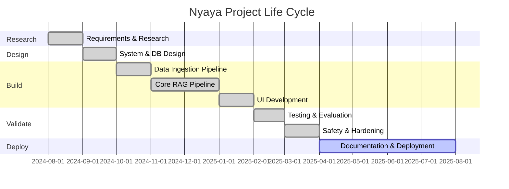

---

## 2. Context Diagram

The Context Diagram shows the system boundary of **Nyaya** and how it interacts with external entities.

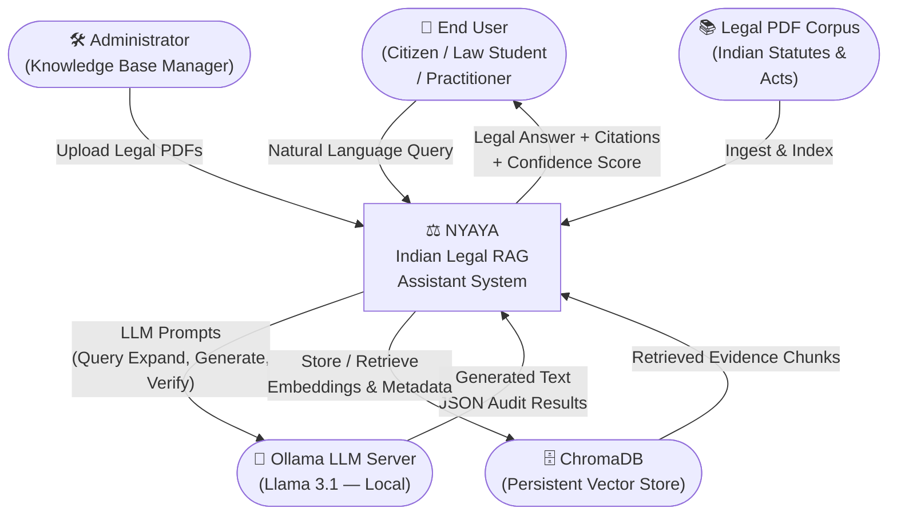

---

## 3. DFD, ERD, Class Diagram, State Transition Diagram

### 3.1 Data Flow Diagram (DFD)

#### Level 0 — Context DFD

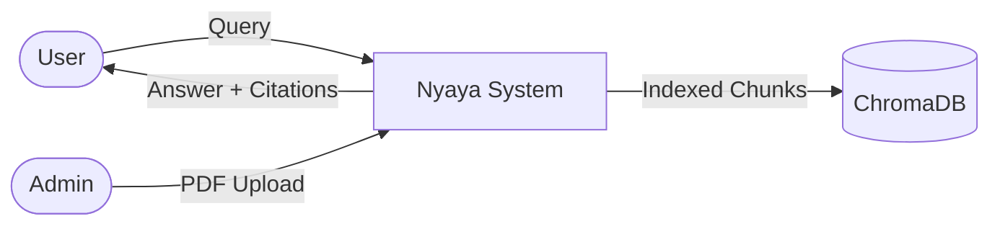

#### Level 1 — Main DFD

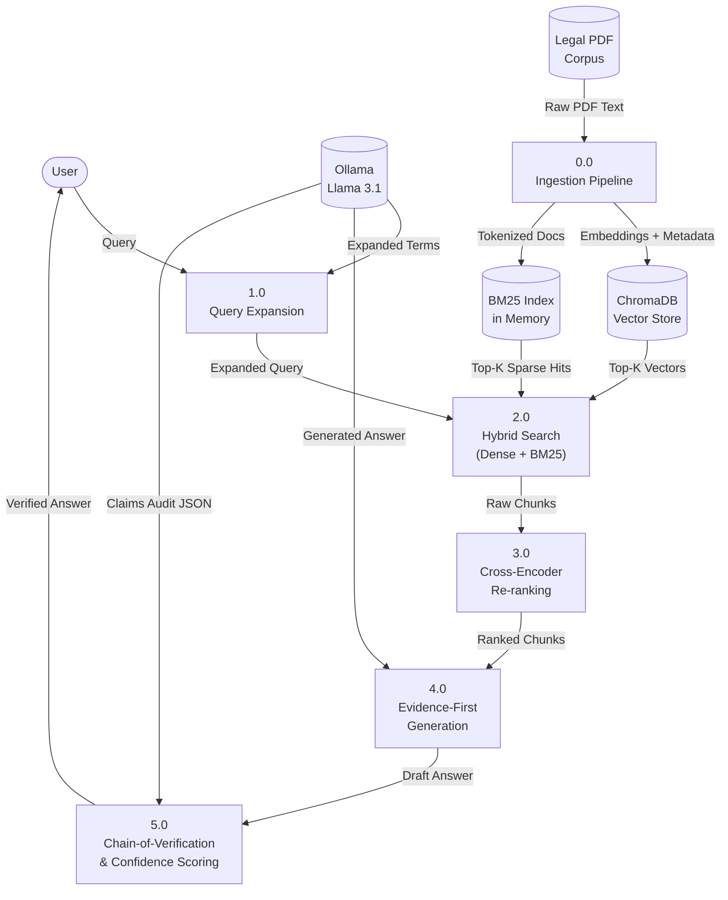

#### Level 2 — Ingestion Sub-process DFD

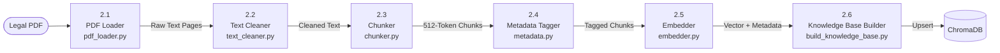

---

### 3.2 Entity-Relationship Diagram (ERD)

```mermaid
erDiagram
    LEGAL_DOCUMENT {
        string doc_id PK
        string source_name
        string act_name
        string file_path
        datetime ingested_at
    }

    CHUNK {
        string chunk_id PK
        string doc_id FK
        string text
        int    start_char
        int    end_char
        string act
        string section
        string pages
    }

    EMBEDDING {
        string chunk_id PK_FK
        float[] vector_384d
        string model_name
    }

    QUERY_SESSION {
        string session_id PK
        string user_query
        string expanded_query
        datetime queried_at
    }

    RETRIEVAL_RESULT {
        string result_id PK
        string session_id FK
        string chunk_id FK
        float  rrf_score
        float  rerank_score
    }

    ANSWER {
        string answer_id PK
        string session_id FK
        string generated_text
        string verified_text
        float  confidence_score
        string confidence_tier
        bool   unsupported_flag
    }

    LEGAL_DOCUMENT ||--o{ CHUNK : "contains"
    CHUNK ||--|| EMBEDDING : "has"
    QUERY_SESSION ||--o{ RETRIEVAL_RESULT : "produces"
    RETRIEVAL_RESULT }o--|| CHUNK : "references"
    QUERY_SESSION ||--|| ANSWER : "generates"
```

---

### 3.3 Class Diagram

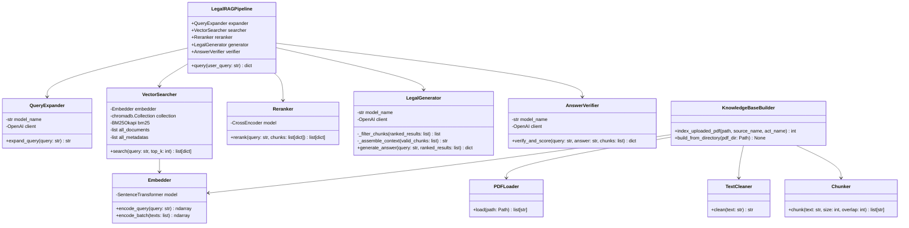

---

### 3.4 State Transition Diagram

Shows the lifecycle of a user query through the Nyaya pipeline.

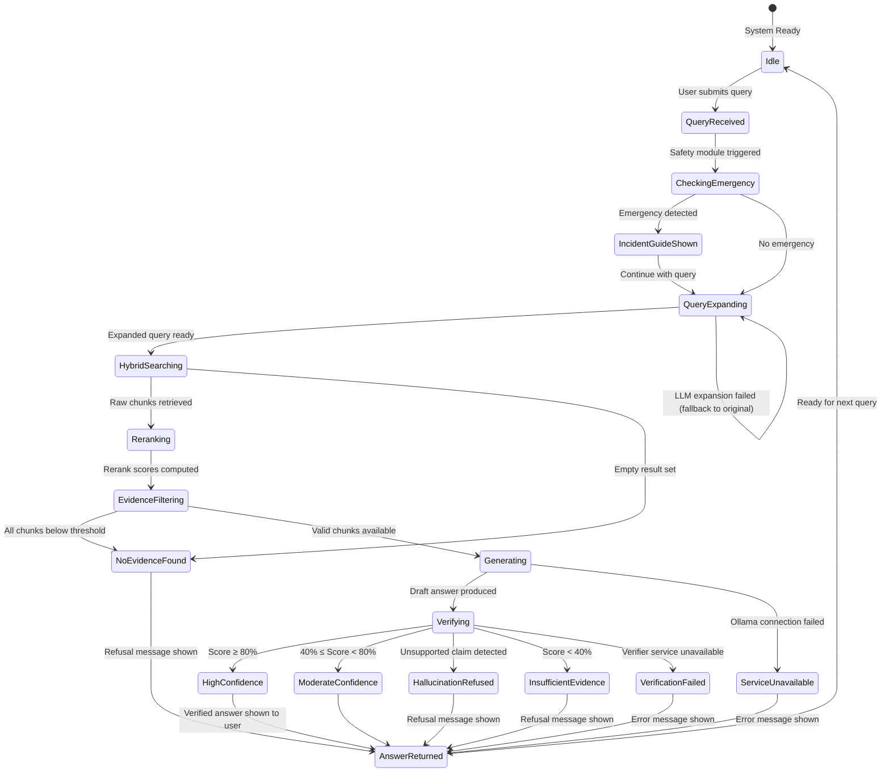

---

## 4. Use Case Diagram

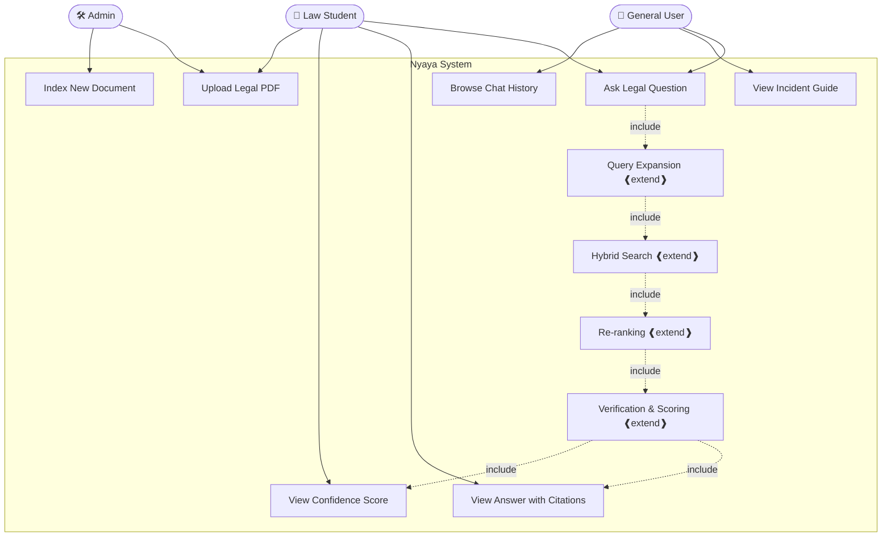

### Use Case Descriptions

| Use Case | Actor | Description |
|---|---|---|
| Ask Legal Question | User, Law Student | Submit a natural language query about any domain of Indian law |
| View Answer with Citations | User, Law Student | Read the statute-grounded answer with PDF evidence citations |
| View Confidence Score | Law Student | Inspect the composite verification confidence badge (High/Moderate) |
| View Incident Guide | User | Access deterministic emergency response steps for crisis situations |
| Upload Legal PDF | Law Student, Admin | Upload a new Indian statute PDF for indexing |
| Index New Document | Admin | Trigger chunking, embedding, and ChromaDB ingestion of uploaded PDF |
| Browse Chat History | User | Review previous Q&A exchanges in the session |
| Query Expansion | System | Translate colloquial terms to formal statutory language via LLM |
| Hybrid Search | System | Retrieve evidence via Dense Vector + BM25 with RRF fusion |
| Re-ranking | System | Score retrieved chunks using MS-MARCO cross-encoder |
| Verification & Scoring | System | Audit draft answer claims and compute composite confidence score |

---

## 5. Activity, Component, and Collaboration Diagrams

### 5.1 Activity Diagram — Query Answering Workflow

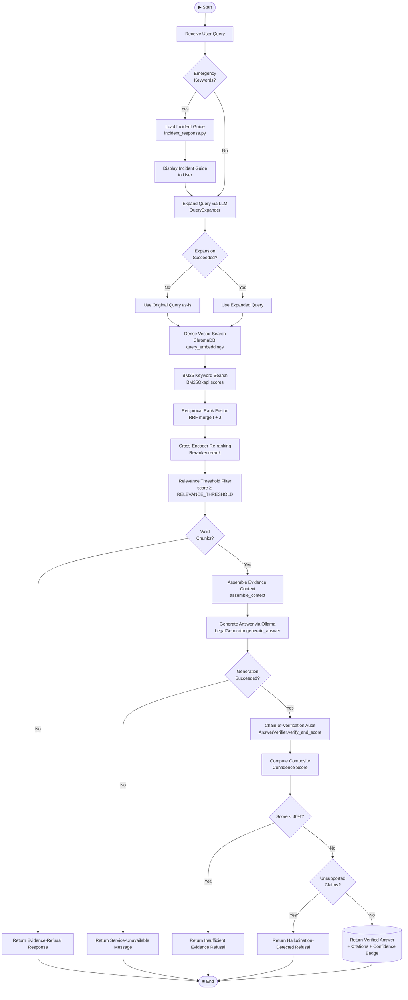

---

### 5.2 Component Diagram

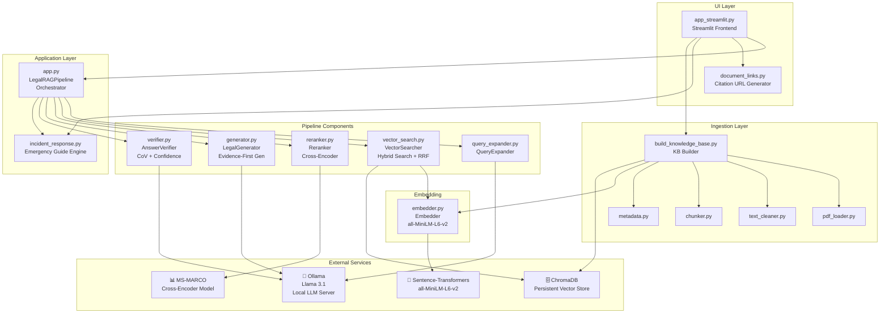

---

### 5.3 Collaboration Diagram (Object Interaction)

The following sequence shows the collaboration between objects during a single query:

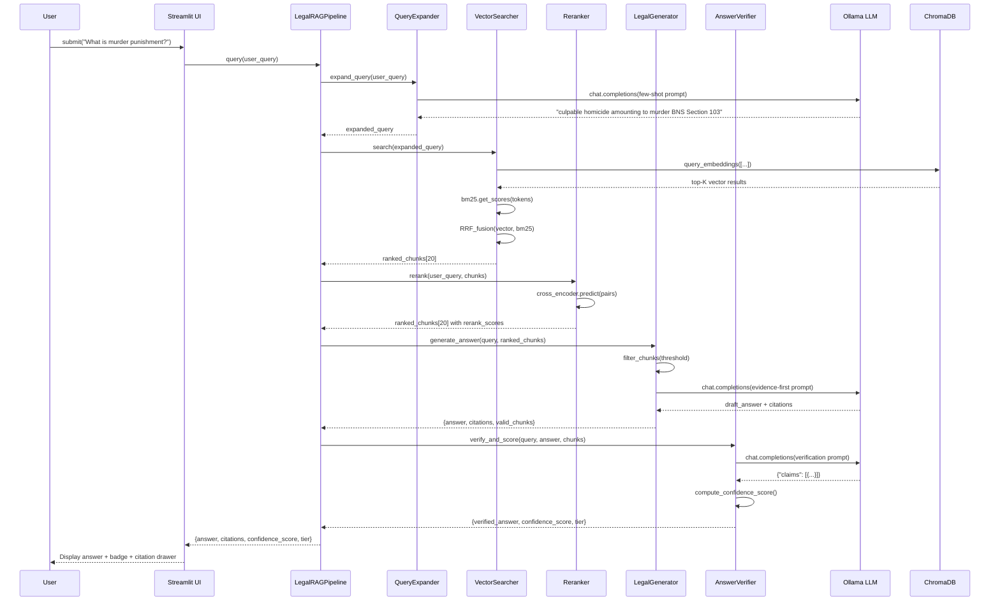

---

## 6. Architecture Design

### 6.1 High-Level Architecture

Nyaya follows a **Layered Modular Architecture** with a strict separation between ingestion, retrieval, generation, and verification layers.

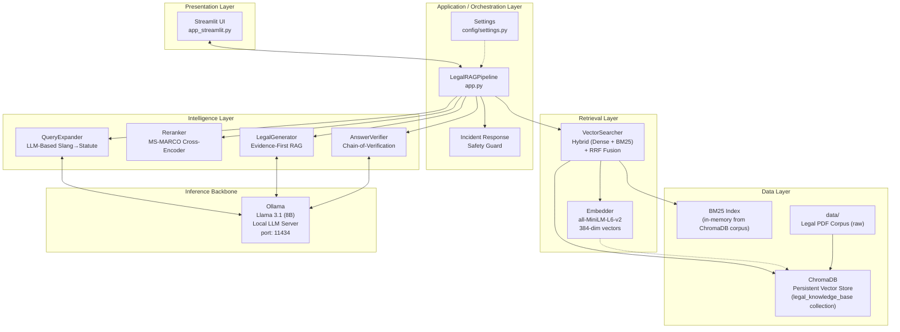

### 6.2 Key Architectural Decisions

| Decision | Choice | Rationale |
|---|---|---|
| LLM Backend | Ollama (local) | Privacy — no user queries leave the machine |
| Vector Store | ChromaDB | Persistent, embedded, no external server needed |
| Embedding Model | all-MiniLM-L6-v2 | 384-dim, fast, excellent semantic similarity |
| Retrieval Strategy | Dense + BM25 via RRF | Covers both semantic and keyword-exact queries |
| Re-ranker | MS-MARCO Cross-Encoder | Highest precision for relevance scoring |
| Hallucination Guard | Chain-of-Verification (CoV) | Structural claim-by-claim evidence audit |
| Confidence Scoring | 60% CoV + 40% Reranker | Composite score balancing quality and retrieval |
| UI Framework | Streamlit | Rapid prototyping, Python-native, chat primitives |

---

## 7. Table Design

The logical table design represents the data model stored in ChromaDB's persistent collection and the in-memory operational structures.

### 7.1 ChromaDB Collection — `legal_knowledge_base`

ChromaDB stores data in a document-vector hybrid structure. The logical table mapping is:

| Column | Type | Description |
|---|---|---|
| `id` | `string` (PK) | Unique chunk identifier (e.g., `sha256_hash_chunk_0`) |
| `embedding` | `float[384]` | Dense vector from `all-MiniLM-L6-v2` |
| `document` | `string` | The cleaned text content of the chunk (≤512 tokens) |
| `metadata.source` | `string` | Source PDF filename |
| `metadata.act` | `string` | Name of the Indian statute (e.g., "Bharatiya Nyaya Sanhita 2023") |
| `metadata.section` | `string` | Section/Chapter reference within the Act |
| `metadata.pages` | `string` | Page range in the source PDF |
| `metadata.doc_id` | `string` | Parent document identifier |

### 7.2 Session State Table (Streamlit In-Memory)

| Column | Type | Description |
|---|---|---|
| `role` | `string` | `"user"` or `"assistant"` |
| `content` | `string` | Message text |
| `metadata.confidence_tier` | `string` | e.g., `"High Confidence (87.4%)"` |
| `metadata.confidence_score` | `float` | e.g., `87.4` |
| `metadata.citations` | `list[dict]` | List of citation metadata objects |
| `metadata.incident_guide` | `IncidentGuide | None` | Emergency guide dataclass or null |

### 7.3 Evaluation Results Table — `evaluation_results.csv`

| Column | Type | Description |
|---|---|---|
| `query` | `string` | Test query string |
| `expected_answer` | `string` | Ground-truth reference answer |
| `generated_answer` | `string` | System-generated answer |
| `confidence_score` | `float` | System confidence percentage |
| `confidence_tier` | `string` | Tier label |
| `citations` | `string` | JSON-serialized citation list |
| `answer_status` | `string` | `verified`, `refused`, `unavailable` |
| `precision` | `float` | Answer quality metric |
| `recall` | `float` | Evidence coverage metric |

### 7.4 Uploaded Documents Tracking (File System)

| Column | Description |
|---|---|
| Filename format | `{sha256_16char}_{original_name}.pdf` |
| Location | `data/uploads/` |
| Purpose | Deduplication (hash prefix) + citation URL serving |

---

## 8. Data-Structure Design

### 8.1 Core Data Structures

#### 8.1.1 `chunk` dictionary (Internal pipeline object)
```python
{
    "text": str,             # Cleaned text of the chunk (≤ 512 tokens)
    "metadata": {
        "source": str,       # Source PDF filename
        "act":    str,       # Indian statute name
        "section": str,      # Section/Chapter reference
        "pages":  str,       # Page range in source PDF
        "doc_id": str        # Parent document ID
    },
    "rrf_score":    float,   # Reciprocal Rank Fusion score (post-search)
    "rerank_score": float    # MS-MARCO cross-encoder score (post-rerank)
}
```

#### 8.1.2 `generation_output` dictionary (LegalGenerator output)
```python
{
    "answer":       str,        # Raw LLM-generated text with inline citations
    "citations":    list[dict], # List of metadata dicts from valid_chunks
    "valid_chunks": list[dict]  # Chunks that passed relevance threshold filter
}
```

#### 8.1.3 `final_response` dictionary (AnswerVerifier output / Pipeline return)
```python
{
    "query":                  str,
    "answer":                 str,        # Verified answer string
    "citations":              list[dict], # Citation metadata list
    "confidence_score":       float,      # 0.0 – 100.0 composite score
    "confidence_tier":        str,        # "High Confidence (87%)" etc.
    "unsupported_content_flag": bool,     # True if hallucination detected
    "verification_details":   list[dict], # Per-claim audit results
    "answer_status":          str,        # "verified" | "refused" | ...
    "incident_guide":         IncidentGuide | None
}
```

#### 8.1.4 `claims_audit` list (Chain-of-Verification result)
```python
[
    {
        "claim":     str,   # Discrete claim extracted from the draft answer
        "supported": bool   # True if directly supported by retrieved evidence
    },
    ...
]
```

#### 8.1.5 `IncidentGuide` dataclass (Safety module)
```python
@dataclass
class IncidentGuide:
    title:          str          # e.g., "Domestic Violence Immediate Steps"
    urgency_notice: str | None   # Red-alert message for life-threatening cases
    steps:          list[str]    # Ordered action steps
    resources:      list[tuple]  # [(label, url), ...]
```

### 8.2 Embedding Vector Structure

| Property | Value |
|---|---|
| Model | `sentence-transformers/all-MiniLM-L6-v2` |
| Dimensionality | 384 floats (`float32`) |
| Normalization | L2-normalized (cosine similarity) |
| Storage | ChromaDB internal HNSW index |
| Query encoding | `model.encode([query])` → shape `(1, 384)` → `.tolist()` |

### 8.3 BM25 Index Structure

| Property | Value |
|---|---|
| Library | `rank_bm25.BM25Okapi` |
| Corpus | All documents fetched from ChromaDB at startup |
| Tokenization | Simple lowercase `.split()` |
| Persistence | In-memory only (rebuilt on each startup) |
| Output | Score array of length `len(corpus)`, top-K indices extracted |

### 8.4 RRF Fusion Dictionary

```python
fused_scores: dict[str, dict] = {
    "<chunk_id>": {
        "score":    float,   # Accumulated RRF score: Σ 1/(k + rank)
        "text":     str,     # Chunk text
        "metadata": dict     # Chunk metadata
    }
}
```

### 8.5 Confidence Scoring Formula

```
Verification Ratio   = supported_claims / total_claims
Normalized Reranker  = clamp((avg_rerank_score + 1.0) / 2.0, 0.0, 1.0)
Composite Score (%)  = ((VR × 0.60) + (NR × 0.40)) × 100
```

| Score Range | Tier |
|---|---|
| ≥ 80% | High Confidence |
| 40% – 79% | Moderate Confidence |
| < 40% | Insufficient Evidence (Refused) |
| Unsupported claim | Hallucination Detected (Refused) |

---

## 9. Deployment Diagram

### 9.1 Local Deployment (Current — Development)

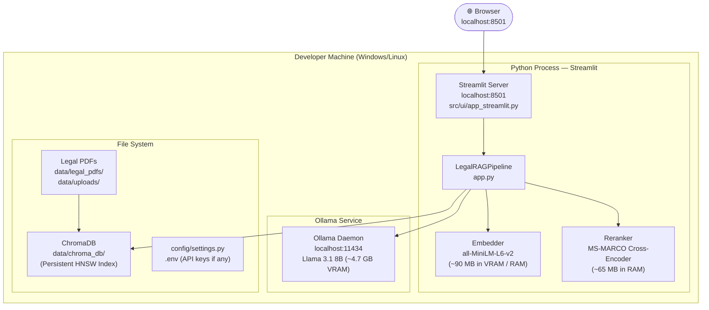

### 9.2 Production Deployment (Recommended Architecture)

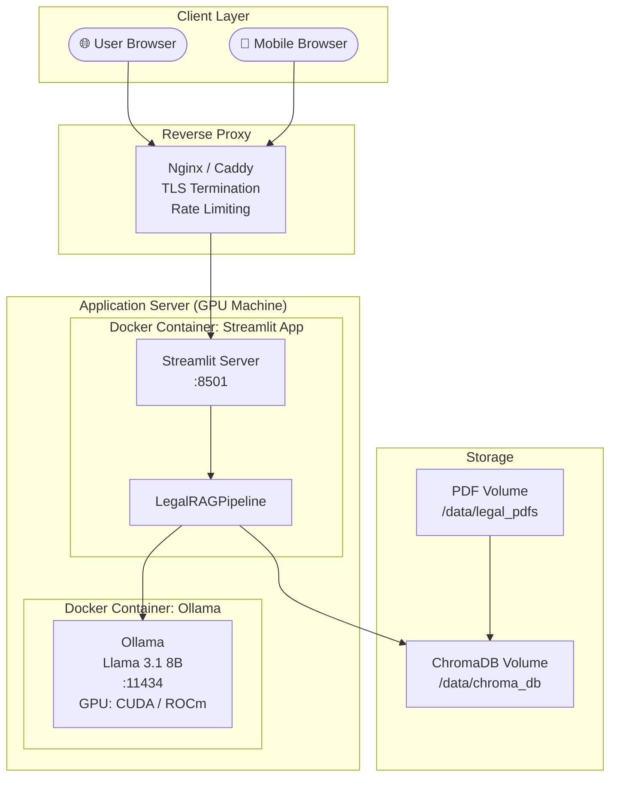

### 9.3 Deployment Configuration Summary

| Component | Local Dev | Production |
|---|---|---|
| Web Server | `streamlit run` | Docker + Nginx reverse proxy |
| LLM Server | `ollama serve` (local daemon) | Ollama in Docker with GPU passthrough |
| Vector DB | ChromaDB PersistentClient (file) | ChromaDB volume-mounted in Docker |
| Embedding Model | Loaded in Python process RAM | Same (model weights in container) |
| Cross-Encoder | Loaded in Python process RAM | Same |
| PDF Storage | `data/` folder (local) | Docker volume / cloud object storage |
| Auth | None | Streamlit Authenticator / Nginx Basic Auth |
| HTTPS | None | Let's Encrypt via Caddy / Nginx |
| Hardware (Minimum) | 16 GB RAM, 8 GB VRAM | 32 GB RAM, 16 GB VRAM (A10/RTX 4090) |

### 9.4 System Requirements

| Resource | Minimum | Recommended |
|---|---|---|
| CPU | 4 cores | 8+ cores |
| RAM | 16 GB | 32 GB |
| GPU VRAM | 6 GB (Llama 3.1 4-bit quantized) | 16 GB (Llama 3.1 8B full) |
| Disk | 20 GB | 50 GB |
| OS | Windows 10 / Ubuntu 20.04 | Ubuntu 22.04 LTS |
| Python | 3.10+ | 3.11+ |
| Ollama | v0.2.0+ | Latest |

---

*Document prepared for: Nyaya — Indian Legal RAG Assistant*
*Project: Indian Legal Knowledge System | System Analysis and Design Report*
